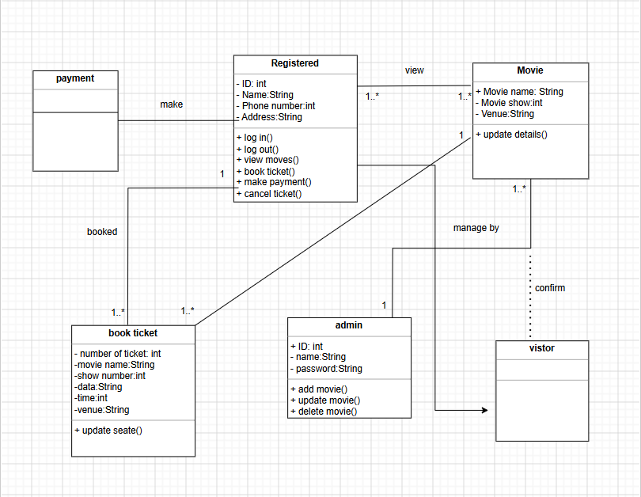
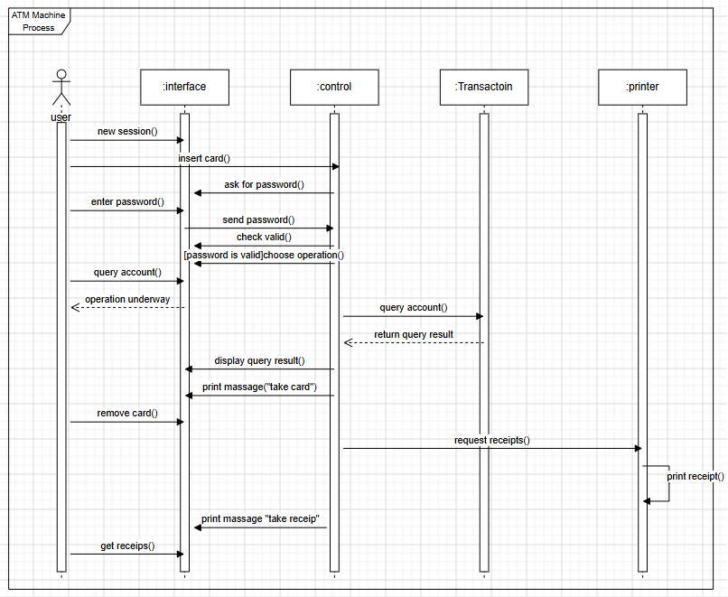
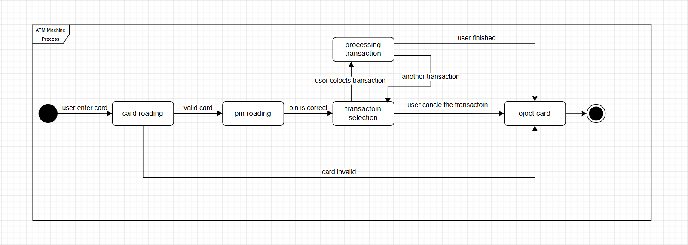
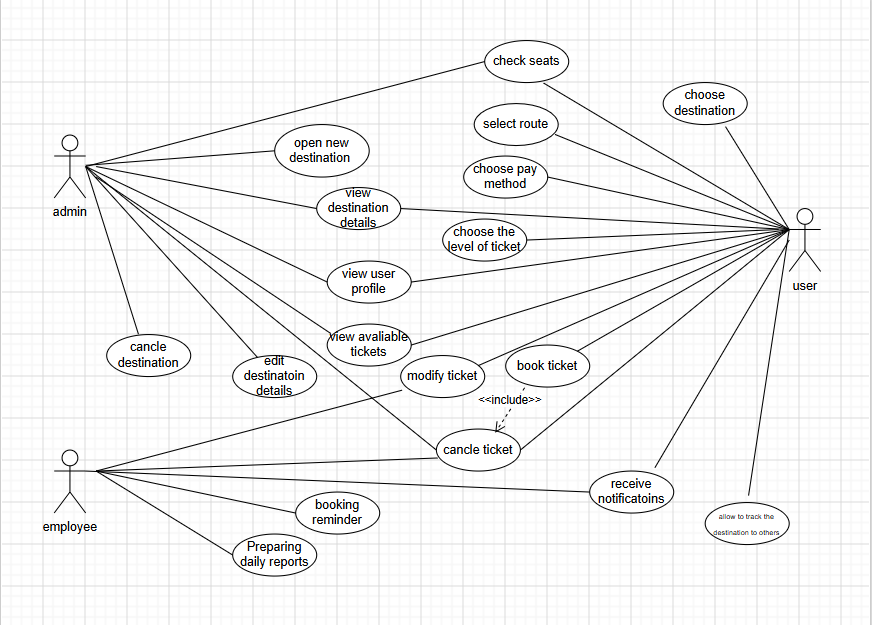

# UML Diagrams – System Analysis and Design
**Course:** IS 1235 – System Analysis and Design  
**University:** Al Imam Mohammad Ibn Saud Islamic University – CCIS  
**Semester:** 2nd Semester 2024–2025

---

## Overview

This repository contains four UML diagrams covering different modeling techniques taught in the Systems Analysis and Design course.

| # | Diagram | System | Modeling Type |
|---|---------|--------|---------------|
| 1 | Class Diagram | Online Cinema Ticket Booking System | Structure Modeling |
| 2 | Sequence Diagram | ATM Machine Process | Interaction Modeling |
| 3 | State Machine Diagram | ATM Machine Process | Behavior Modeling |
| 4 | Use Case Diagram | Travel Ticket Booking System | Use Case Modeling |

---

## Repository Structure

```
├── diagrams/
│   ├── class-diagram.png
│   ├── sequence-diagram.png
│   ├── state-machine-diagram.png
│   └── use-case-diagram.png
└── README.md
```

---

## Diagram 1 – Class Diagram
**System:** Online Cinema Ticket Booking System  
**Type:** Structure Modeling

### Scenario
An online cinema ticketing system allows registered users to browse movies and book tickets. Each movie stores its name, show time, and venue. A registered user can log in, log out, view movies, book tickets, make payments, and cancel tickets. When a ticket is booked, the system records the number of tickets, movie name, show number, date, time, and venue, and updates seat availability. The admin manages the movie catalog by adding, updating, and deleting movie records. Visitors can confirm registration through the admin to gain access to the system.

### Classes
- **RegisteredUser** — the main actor who interacts with the system
- **Movie** — stores all movie details
- **BookTicket** — records booking information
- **Payment** — handles the payment transaction
- **Admin** — manages movie records
- **Visitor** — unregistered user seeking access

### Diagram


---

## Diagram 2 – Sequence Diagram
**System:** ATM Machine Process  
**Type:** Use Case Interaction Modeling

### Scenario
The ATM machine process involves four components: ATM Interface, ATM Control, Transaction Unit, and Printer. The user starts a new session and inserts their card into the ATM Interface. The ATM Control requests a password through the interface. The user enters their password, which is sent to ATM Control for validation. If the password is valid, the system prompts the user to choose an operation. The user queries their account; ATM Control forwards the request to the Transaction Unit, which returns the result. ATM Control displays the result and instructs the user to take their card. After the user removes the card, ATM Control requests a receipt from the Printer, which prints it. The user is notified to collect the receipt.

### Components (Lifelines)
- **User** — initiates all actions
- **:ATM Interface** — front-end component the user interacts with
- **:ATM Control** — core controller handling all logic
- **:Transaction Unit** — processes account queries
- **:Printer** — prints receipts

### Diagram


---

## Diagram 3 – State Machine Diagram
**System:** ATM Machine Process  
**Type:** Object Behavior Modeling

### Scenario
When a user inserts a card into the ATM, the machine begins reading it. If the card is invalid, it is immediately ejected. If the card is valid, the machine moves to reading the PIN. After a correct PIN is entered, the user is presented with a transaction selection screen. The user may select a transaction, which the system processes. After processing, the user can choose to perform another transaction or finish. If the user cancels at any point, or after the final transaction is complete, the card is ejected and the session ends.

### States
| State | Description |
|-------|-------------|
| Card reading | Machine reads and validates the inserted card |
| PIN reading | Machine waits for and validates the user's PIN |
| Transaction selection | User chooses the type of transaction |
| Processing transaction | System executes the selected transaction |
| Eject card | Session ends and card is returned to user |

### Diagram


---

## Diagram 4 – Use Case Diagram
**System:** Travel Ticket Booking System  
**Type:** Use Case Modeling

### Scenario
A travel ticket booking system serves three actors: Admin, Employee, and User. The Admin manages destinations by opening new ones, viewing and editing destination details, and canceling destinations. The User can choose a destination, check available seats, select a route, choose a ticket level, choose a payment method, and book a ticket. When booking, the system automatically includes a cancel ticket option via an `<<include>>` relationship. The User can also modify an existing ticket, view available tickets, view their profile, and receive booking notifications, including allowing others to track the destination. The Employee handles operational tasks such as sending booking reminders and preparing daily reports.

### Actors
| Actor | Responsibilities |
|-------|-----------------|
| Admin | Manages destinations (open, edit, cancel) |
| User | Books, modifies, and cancels tickets; receives notifications |
| Employee | Sends reminders and prepares daily reports |

### Key Relationships
- `book ticket` **<<include>>** `cancel ticket` — cancellation is always available when booking

### Diagram


---

## Tools Used
- [draw.io](https://draw.io) — UML diagram design

---

## About
Third-year Information Systems student at IMAMU. These diagrams were created as part of the Systems Analysis and Design course to practice UML structure, interaction, and behavior modeling.
